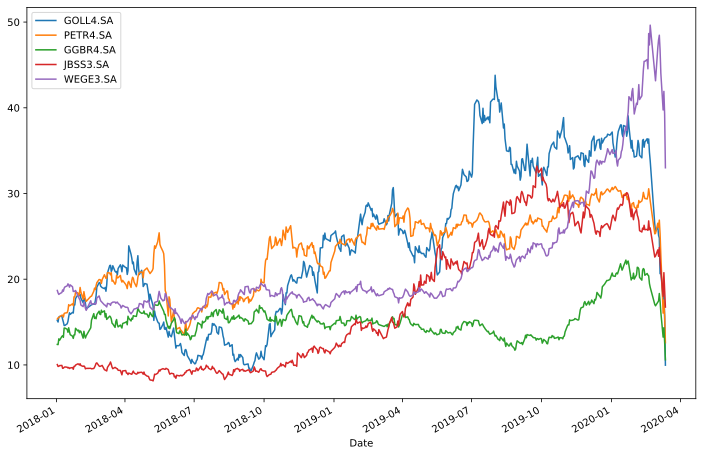

# Python para finanças e investimentos

---
## Importando bibliotecas


```python
import numpy as np 
import pandas as pd 
import matplotlib.pyplot as plt 
import time
from pandas_datareader import data as wb 
```

---

---
## Recomendações do O PRIMO RICO para investir o capital

### 25% -- Ações
### 25% -- Fundos imobiliários
### 25% -- Investimentos internacionais
### 25% -- Caixa
---

---

## Tikers de ações

### Linhas áereas
- GOLL4.SA
- AZUL4.SA

### Petróleo
- PERT4.SA
- PETR3.SA

### Minérios
- VALE3.SA
- GGBR4.SA

### Frigoríficos
- JBSS3.SA
- MRFG3.SA
- BRFS3.SA
- BEEF3.SA

### Energia
- WEGE3.SA

### Bancos
- ITBU3.SA
- ITSA4.SA
- ITSA3.SA

### Odonto
- ODPV3.SA

### Vestuário
- GRND3.SA
- ALPA4.SA
- ALPA3.SA
- HGTX3.SA

### Serviços financeiros
- CIEL3.SA
- B3SA3.SA
- IRBR3.SA

### Hotéis
- HTMX11.SA
- HOOT3.SA

### Farma
- BIOM3.SA
- GBIO33.SA
- PNVL3.SA
- PNVL4.SA
- HYPE3.SA
- OFSA3.SA
- RADL3.SA

---

--- 
## Tiker de ações


```python
inicio = time.time()
linhas_aereas = ['GOLL4.SA', 'AZUL4.SA']
petroleo = ['PETR4.SA', 'PETR3.SA']
minerios = ['VALE3.SA', 'GGBR4.SA']
frigorificos = ['JBSS3.SA', 'MRFG3.SA', 'BRFS3.SA', 'BEEF3.SA']
energia = ['WEGE3.SA']
bancos = ['ITUB3.SA', 'ITSA4.SA', 'ITSA3.SA']
odonto = ['ODPV3.SA']
vestuario = ['GRND3.SA', 'ALPA4.SA', 'ALPA3.SA', 'HGTX3.SA']
hoteis = ['HTMX11.SA']
servicos_financeiros = ['CIEL3.SA', 'B3SA3.SA', 'IRBR3.SA']
farma = ['BIOM3.SA', 'GBIO33.SA', 'PNVL3.SA', 'PNVL4.SA', 'HYPE3.SA', 'OFSA3.SA', 'RADL3.SA']

todas = ['GOLL4.SA', 'AZUL4.SA', 'PETR4.SA', 'PETR3.SA', 'VALE3.SA', 'GGBR4.SA', 'JBSS3.SA', 'MRFG3.SA', 'BRFS3.SA', 'BEEF3.SA', 'WEGE3.SA', 'ITUB3.SA', 'ITSA4.SA', 'ITSA3.SA', 'ODPV3.SA', 'GRND3.SA', 'ALPA4.SA', 'ALPA3.SA', 'HGTX3.SA', 'HTMX11.SA', 'CIEL3.SA', 'B3SA3.SA', 'IRBR3.SA', 'BIOM3.SA', 'GBIO33.SA', 'PNVL3.SA', 'PNVL4.SA', 'HYPE3.SA', 'OFSA3.SA', 'RADL3.SA']

acoes = ['GOLL4.SA', 'PETR4.SA', 'GGBR4.SA', 'JBSS3.SA', 'WEGE3.SA']
```

---

---
## Funções para cálculos de finanças


```python
def get_dataframe(tikers):
    data_frame = pd.DataFrame()
    for t in tikers:
        data_frame[t] = wb.DataReader(t, data_source='yahoo', start='2020-1-1')['Adj Close']
    return data_frame

def plot_graph(data_frame, size):
    data_frame.plot(figsize=size)
    plt.show()

def normalize(data_frame):
    return (data_frame / data_frame.iloc[0] * 100)

def simple_return(data_frame):
    return (data_frame / data_frame.shift(1)) - 1

def log_return(data_frame):
    return np.log(data_frame / data_frame.shift(1))

def s_day_return(tikers):
    return simple_return(get_dataframe(tikers)).mean()

def s_anual_return(tikers):
    return s_day_return(tikers) * 250

def s_percentual_return(tikers):
    return s_anual_return(tikers) * 100

def l_day_return(tikers):
    return log_return(get_dataframe(tikers)).mean()

def l_anual_return(tikers):
    return l_day_return(tikers) * 250

def l_percentual_return(tikers):
    return l_anual_return(tikers) * 100

def vol_return(log_return):
    quant_pesos = log_return.shape[1]
    retorno_portifolio = []
    retorno_volatividade = []
    pesos = []
    
    for i in range(100):

        weigth = []
        for i in range(quant_pesos):
            weigth.append(np.random.random())
        weigth = np.array(weigth)
        weigth /= sum(weigth)

        retorno_portifolio.append(np.sum(weigth * log_return.mean()) * 250)
        retorno_volatividade.append(np.sqrt(np.dot(weigth.T, np.dot(log_return.cov() * 250, weigth))))
        pesos.append(weigth)

    retorno_portifolio = np.array(retorno_portifolio)
    retorno_volatividade = np.array(retorno_volatividade)

    portfolios = pd.DataFrame({'Return': retorno_portifolio, 'Volatility': retorno_volatividade})
    
    pesos = pd.DataFrame(pesos)

    for p in range(pesos.shape[1]):
        portfolios[p] = pesos[p]

    return portfolios

def plot_volatility(dados):
    dados.plot(figsize=(15,9), y = 'Return', x = 'Volatility', kind = 'scatter', marker = '*', s = 100, color='b')
    plt.xlabel = 'Volatility'
    plt.ylabel = 'Return'
    plt.show()
```

---

---
## Análise das ações das empresas de linhas aéreas

#### A tabela abaixo representa o valor de fechamento das ações de 2018 até 2020/03/10


```python
get_dataframe(linhas_aereas)
```


<div>
<style scoped>
    .dataframe tbody tr th:only-of-type {
        vertical-align: middle;
    }

    .dataframe tbody tr th {
        vertical-align: top;
    }

    .dataframe thead th {
        text-align: right;
    }
</style>
<table border="1" class="dataframe">
  <thead>
    <tr style="text-align: right;">
      <th></th>
      <th>GOLL4.SA</th>
      <th>AZUL4.SA</th>
    </tr>
    <tr>
      <th>Date</th>
      <th></th>
      <th></th>
    </tr>
  </thead>
  <tbody>
    <tr>
      <th>2018-01-02</th>
      <td>15.190000</td>
      <td>27.150000</td>
    </tr>
    <tr>
      <th>2018-01-03</th>
      <td>15.010000</td>
      <td>27.059999</td>
    </tr>
    <tr>
      <th>2018-01-04</th>
      <td>15.580000</td>
      <td>27.230000</td>
    </tr>
    <tr>
      <th>2018-01-05</th>
      <td>15.660000</td>
      <td>27.200001</td>
    </tr>
    <tr>
      <th>2018-01-08</th>
      <td>15.700000</td>
      <td>26.910000</td>
    </tr>
    <tr>
      <th>...</th>
      <td>...</td>
      <td>...</td>
    </tr>
    <tr>
      <th>2020-03-06</th>
      <td>21.049999</td>
      <td>38.680000</td>
    </tr>
    <tr>
      <th>2020-03-09</th>
      <td>17.379999</td>
      <td>32.099998</td>
    </tr>
    <tr>
      <th>2020-03-10</th>
      <td>18.320000</td>
      <td>36.180000</td>
    </tr>
    <tr>
      <th>2020-03-11</th>
      <td>15.650000</td>
      <td>30.250000</td>
    </tr>
    <tr>
      <th>2020-03-12</th>
      <td>9.970000</td>
      <td>20.299999</td>
    </tr>
  </tbody>
</table>
<p>540 rows × 2 columns</p>
</div>


#### O gráfico abaixo representa o valor das ações


```python
plot_graph(get_dataframe(linhas_aereas), (13,8))
```


```python
dados_normalizados = normalize(get_dataframe(linhas_aereas))
```

#### O grágico abaixo representa o percentual de valorização das ações


```python
plot_graph(dados_normalizados, (13,8))
```


```python
retorno_simples = simple_return(get_dataframe(linhas_aereas))
```

#### O gráfico abaixo representa a variação das ações em relação a média


```python
plot_graph(retorno_simples, (13,8))
```


#### A tabela abaixo representa a valorização das ações em % em aproximadamente 1 ano


```python
s_percentual_return(linhas_aereas)
```


    GOLL4.SA    3.668672
    AZUL4.SA    1.024326
    dtype: float64


```python
retorno_logaritmo = log_return(get_dataframe(linhas_aereas))
```

#### A tabela abaixo representa os resultados com o maior retorno e menor volatividade em ordem cresente


```python
retorno_volatividade = vol_return(log_return(get_dataframe(linhas_aereas)))
retorno_volatividade.sort_values(['Return', 'Volatility'], ascending=[True, False], inplace=True)
retorno_volatividade
```


<div>
<style scoped>
    .dataframe tbody tr th:only-of-type {
        vertical-align: middle;
    }

    .dataframe tbody tr th {
        vertical-align: top;
    }

    .dataframe thead th {
        text-align: right;
    }
</style>
<table border="1" class="dataframe">
  <thead>
    <tr style="text-align: right;">
      <th></th>
      <th>Return</th>
      <th>Volatility</th>
      <th>0</th>
      <th>1</th>
    </tr>
  </thead>
  <tbody>
    <tr>
      <th>69</th>
      <td>-0.195223</td>
      <td>0.692732</td>
      <td>0.998805</td>
      <td>0.001195</td>
    </tr>
    <tr>
      <th>74</th>
      <td>-0.193543</td>
      <td>0.686290</td>
      <td>0.971004</td>
      <td>0.028996</td>
    </tr>
    <tr>
      <th>14</th>
      <td>-0.191413</td>
      <td>0.678278</td>
      <td>0.935770</td>
      <td>0.064230</td>
    </tr>
    <tr>
      <th>70</th>
      <td>-0.190826</td>
      <td>0.676097</td>
      <td>0.926043</td>
      <td>0.073957</td>
    </tr>
    <tr>
      <th>71</th>
      <td>-0.187738</td>
      <td>0.664865</td>
      <td>0.874948</td>
      <td>0.125052</td>
    </tr>
    <tr>
      <th>...</th>
      <td>...</td>
      <td>...</td>
      <td>...</td>
      <td>...</td>
    </tr>
    <tr>
      <th>0</th>
      <td>-0.139631</td>
      <td>0.553396</td>
      <td>0.078965</td>
      <td>0.921035</td>
    </tr>
    <tr>
      <th>90</th>
      <td>-0.139407</td>
      <td>0.553217</td>
      <td>0.075252</td>
      <td>0.924748</td>
    </tr>
    <tr>
      <th>58</th>
      <td>-0.137964</td>
      <td>0.552152</td>
      <td>0.051373</td>
      <td>0.948627</td>
    </tr>
    <tr>
      <th>75</th>
      <td>-0.135819</td>
      <td>0.550845</td>
      <td>0.015877</td>
      <td>0.984123</td>
    </tr>
    <tr>
      <th>20</th>
      <td>-0.135489</td>
      <td>0.550673</td>
      <td>0.010422</td>
      <td>0.989578</td>
    </tr>
  </tbody>
</table>
<p>100 rows × 4 columns</p>
</div>


#### O gráfico abaixo representa área de retorno e volatividade de acordo com a teoria de Markowitz


```python
plot_volatility(retorno_volatividade)
```


---

---
## Análise de ações de empresas de petróleo

#### A tabela abaixo representa o valor de fechamento das ações de 2018 até 2020/03/10


```python
get_dataframe(petroleo)
```


<div>
<style scoped>
    .dataframe tbody tr th:only-of-type {
        vertical-align: middle;
    }

    .dataframe tbody tr th {
        vertical-align: top;
    }

    .dataframe thead th {
        text-align: right;
    }
</style>
<table border="1" class="dataframe">
  <thead>
    <tr style="text-align: right;">
      <th></th>
      <th>PETR4.SA</th>
      <th>PETR3.SA</th>
    </tr>
    <tr>
      <th>Date</th>
      <th></th>
      <th></th>
    </tr>
  </thead>
  <tbody>
    <tr>
      <th>2018-01-02</th>
      <td>15.354614</td>
      <td>16.876842</td>
    </tr>
    <tr>
      <th>2018-01-03</th>
      <td>15.493781</td>
      <td>17.091085</td>
    </tr>
    <tr>
      <th>2018-01-04</th>
      <td>15.521611</td>
      <td>17.237167</td>
    </tr>
    <tr>
      <th>2018-01-05</th>
      <td>15.614388</td>
      <td>17.373505</td>
    </tr>
    <tr>
      <th>2018-01-08</th>
      <td>15.799945</td>
      <td>17.646183</td>
    </tr>
    <tr>
      <th>...</th>
      <td>...</td>
      <td>...</td>
    </tr>
    <tr>
      <th>2020-03-06</th>
      <td>22.830000</td>
      <td>24.059999</td>
    </tr>
    <tr>
      <th>2020-03-09</th>
      <td>16.049999</td>
      <td>16.920000</td>
    </tr>
    <tr>
      <th>2020-03-10</th>
      <td>17.559999</td>
      <td>18.360001</td>
    </tr>
    <tr>
      <th>2020-03-11</th>
      <td>15.700000</td>
      <td>16.370001</td>
    </tr>
    <tr>
      <th>2020-03-12</th>
      <td>12.600000</td>
      <td>12.920000</td>
    </tr>
  </tbody>
</table>
<p>540 rows × 2 columns</p>
</div>


#### O gráfico abaixo representa o valor das ações


```python
plot_graph(get_dataframe(petroleo), (12,8))
```


#### O grágico abaixo representa o percentual de valorização das ações


```python
plot_graph(normalize(get_dataframe(petroleo)), (12,8))
```


```python
retorno_simples = simple_return(get_dataframe(petroleo))
```

#### O gráfico abaixo representa a variação das ações em relação a média


```python
plot_graph(retorno_simples, (12,8))
```


#### A tabela abaixo representa a valorização das ações em % em aproximadamente 1 ano


```python
s_percentual_return(petroleo)
```


    PETR4.SA    4.170340
    PETR3.SA    0.358795
    dtype: float64


#### A tabela abaixo representa os resultados com o maior retorno e menor volatividade em ordem cresente


```python
retorno_logaritmo = log_return(get_dataframe(petroleo))
retorno_volatividade = vol_return(retorno_logaritmo)
retorno_volatividade.sort_values(['Return', 'Volatility'], ascending=[True, False], inplace=True)
retorno_volatividade
```


<div>
<style scoped>
    .dataframe tbody tr th:only-of-type {
        vertical-align: middle;
    }

    .dataframe tbody tr th {
        vertical-align: top;
    }

    .dataframe thead th {
        text-align: right;
    }
</style>
<table border="1" class="dataframe">
  <thead>
    <tr style="text-align: right;">
      <th></th>
      <th>Return</th>
      <th>Volatility</th>
      <th>0</th>
      <th>1</th>
    </tr>
  </thead>
  <tbody>
    <tr>
      <th>53</th>
      <td>-0.123884</td>
      <td>0.515159</td>
      <td>0.001048</td>
      <td>0.998952</td>
    </tr>
    <tr>
      <th>93</th>
      <td>-0.122920</td>
      <td>0.514987</td>
      <td>0.030979</td>
      <td>0.969021</td>
    </tr>
    <tr>
      <th>30</th>
      <td>-0.122429</td>
      <td>0.514912</td>
      <td>0.046221</td>
      <td>0.953779</td>
    </tr>
    <tr>
      <th>73</th>
      <td>-0.122409</td>
      <td>0.514909</td>
      <td>0.046843</td>
      <td>0.953157</td>
    </tr>
    <tr>
      <th>17</th>
      <td>-0.122017</td>
      <td>0.514854</td>
      <td>0.059005</td>
      <td>0.940995</td>
    </tr>
    <tr>
      <th>...</th>
      <td>...</td>
      <td>...</td>
      <td>...</td>
      <td>...</td>
    </tr>
    <tr>
      <th>83</th>
      <td>-0.095330</td>
      <td>0.522993</td>
      <td>0.887491</td>
      <td>0.112509</td>
    </tr>
    <tr>
      <th>57</th>
      <td>-0.095073</td>
      <td>0.523183</td>
      <td>0.895496</td>
      <td>0.104504</td>
    </tr>
    <tr>
      <th>0</th>
      <td>-0.092636</td>
      <td>0.525088</td>
      <td>0.971143</td>
      <td>0.028857</td>
    </tr>
    <tr>
      <th>80</th>
      <td>-0.092520</td>
      <td>0.525183</td>
      <td>0.974730</td>
      <td>0.025270</td>
    </tr>
    <tr>
      <th>67</th>
      <td>-0.092467</td>
      <td>0.525228</td>
      <td>0.976396</td>
      <td>0.023604</td>
    </tr>
  </tbody>
</table>
<p>100 rows × 4 columns</p>
</div>


#### O gráfico abaixo representa área de retorno e volatividade de acordo com a teoria de Markowitz


```python
plot_volatility(retorno_volatividade)
```


---

---
## Análise de empresas de minério

#### O gráfico abaixo representa o valor das ações


```python
plot_graph(get_dataframe(minerios), (12,8))
```


#### O grágico abaixo representa o percentual de valorização das ações


```python
plot_graph(normalize(get_dataframe(minerios)), (12,8))
```


#### O gráfico abaixo representa a variação das ações em relação a média


```python
retorno_simples = simple_return(get_dataframe(minerios))
plot_graph(retorno_simples, (12,8))
```


#### A tabela abaixo representa a valorização das ações em % em aproximadamente 1 ano


```python
s_percentual_return(minerios)
```


    VALE3.SA    4.595354
    GGBR4.SA    2.132070
    dtype: float64


#### A tabela abaixo representa os resultados com o maior retorno e menor volatividade em ordem cresente


```python
retorno_logaritmo = log_return(get_dataframe(minerios))
retorno_volatividade = vol_return(retorno_logaritmo)
retorno_volatividade.sort_values(['Return', 'Volatility'], ascending=[True, False], inplace=True)
retorno_volatividade
```


<div>
<style scoped>
    .dataframe tbody tr th:only-of-type {
        vertical-align: middle;
    }

    .dataframe tbody tr th {
        vertical-align: top;
    }

    .dataframe thead th {
        text-align: right;
    }
</style>
<table border="1" class="dataframe">
  <thead>
    <tr style="text-align: right;">
      <th></th>
      <th>Return</th>
      <th>Volatility</th>
      <th>0</th>
      <th>1</th>
    </tr>
  </thead>
  <tbody>
    <tr>
      <th>44</th>
      <td>-0.072245</td>
      <td>0.434599</td>
      <td>0.008101</td>
      <td>0.991899</td>
    </tr>
    <tr>
      <th>4</th>
      <td>-0.072064</td>
      <td>0.433529</td>
      <td>0.015041</td>
      <td>0.984959</td>
    </tr>
    <tr>
      <th>88</th>
      <td>-0.071451</td>
      <td>0.430009</td>
      <td>0.038472</td>
      <td>0.961528</td>
    </tr>
    <tr>
      <th>51</th>
      <td>-0.070939</td>
      <td>0.427178</td>
      <td>0.058060</td>
      <td>0.941940</td>
    </tr>
    <tr>
      <th>43</th>
      <td>-0.070235</td>
      <td>0.423460</td>
      <td>0.084951</td>
      <td>0.915049</td>
    </tr>
    <tr>
      <th>...</th>
      <td>...</td>
      <td>...</td>
      <td>...</td>
      <td>...</td>
    </tr>
    <tr>
      <th>9</th>
      <td>-0.049007</td>
      <td>0.419639</td>
      <td>0.896405</td>
      <td>0.103595</td>
    </tr>
    <tr>
      <th>60</th>
      <td>-0.048345</td>
      <td>0.422925</td>
      <td>0.921706</td>
      <td>0.078294</td>
    </tr>
    <tr>
      <th>77</th>
      <td>-0.048301</td>
      <td>0.423151</td>
      <td>0.923394</td>
      <td>0.076606</td>
    </tr>
    <tr>
      <th>70</th>
      <td>-0.047821</td>
      <td>0.425657</td>
      <td>0.941759</td>
      <td>0.058241</td>
    </tr>
    <tr>
      <th>94</th>
      <td>-0.046316</td>
      <td>0.434093</td>
      <td>0.999270</td>
      <td>0.000730</td>
    </tr>
  </tbody>
</table>
<p>100 rows × 4 columns</p>
</div>


#### O gráfico abaixo representa área de retorno e volatividade de acordo com a teoria de Markowitz


```python
plot_volatility(retorno_volatividade)
```


---

---
## Análises de empresas de frigoríficos

#### O gráfico abaixo representa o valor das ações


```python
plot_graph(get_dataframe(frigorificos), (12,8))
```


#### O grágico abaixo representa o percentual de valorização das ações


```python
plot_graph(normalize(get_dataframe(frigorificos)), (12,8))
```


#### O gráfico abaixo representa a variação das ações em relação a média


```python
retorno_simples = simple_return(get_dataframe(frigorificos))
plot_graph(retorno_simples, (12,8))
```


#### A tabela abaixo representa a valorização das ações em % em aproximadamente 1 ano


```python
s_percentual_return(frigorificos)
```


    JBSS3.SA    34.185140
    MRFG3.SA    13.966635
    BRFS3.SA   -30.453353
    BEEF3.SA    -9.307995
    dtype: float64


#### A tabela abaixo representa os resultados com o maior retorno e menor volatividade em ordem cresente


```python
retorno_logaritmo = log_return(get_dataframe(frigorificos))
retorno_volatividade = vol_return(retorno_logaritmo)
retorno_volatividade.sort_values(['Return', 'Volatility'], ascending=[True, False], inplace=True)
retorno_volatividade
```


<div>
<style scoped>
    .dataframe tbody tr th:only-of-type {
        vertical-align: middle;
    }

    .dataframe tbody tr th {
        vertical-align: top;
    }

    .dataframe thead th {
        text-align: right;
    }
</style>
<table border="1" class="dataframe">
  <thead>
    <tr style="text-align: right;">
      <th></th>
      <th>Return</th>
      <th>Volatility</th>
      <th>0</th>
      <th>1</th>
      <th>2</th>
      <th>3</th>
    </tr>
  </thead>
  <tbody>
    <tr>
      <th>40</th>
      <td>-0.284444</td>
      <td>0.384163</td>
      <td>0.019682</td>
      <td>0.049585</td>
      <td>0.482424</td>
      <td>0.448308</td>
    </tr>
    <tr>
      <th>62</th>
      <td>-0.278442</td>
      <td>0.382441</td>
      <td>0.069709</td>
      <td>0.014552</td>
      <td>0.523110</td>
      <td>0.392630</td>
    </tr>
    <tr>
      <th>4</th>
      <td>-0.262470</td>
      <td>0.380562</td>
      <td>0.027468</td>
      <td>0.103864</td>
      <td>0.446994</td>
      <td>0.421674</td>
    </tr>
    <tr>
      <th>20</th>
      <td>-0.260710</td>
      <td>0.378751</td>
      <td>0.074919</td>
      <td>0.062901</td>
      <td>0.496604</td>
      <td>0.365576</td>
    </tr>
    <tr>
      <th>77</th>
      <td>-0.259308</td>
      <td>0.399446</td>
      <td>0.172592</td>
      <td>0.039327</td>
      <td>0.665939</td>
      <td>0.122142</td>
    </tr>
    <tr>
      <th>...</th>
      <td>...</td>
      <td>...</td>
      <td>...</td>
      <td>...</td>
      <td>...</td>
      <td>...</td>
    </tr>
    <tr>
      <th>64</th>
      <td>0.038903</td>
      <td>0.384371</td>
      <td>0.440892</td>
      <td>0.269018</td>
      <td>0.039807</td>
      <td>0.250283</td>
    </tr>
    <tr>
      <th>68</th>
      <td>0.046666</td>
      <td>0.379085</td>
      <td>0.534483</td>
      <td>0.121976</td>
      <td>0.055671</td>
      <td>0.287870</td>
    </tr>
    <tr>
      <th>60</th>
      <td>0.062829</td>
      <td>0.403847</td>
      <td>0.425337</td>
      <td>0.424861</td>
      <td>0.043147</td>
      <td>0.106655</td>
    </tr>
    <tr>
      <th>99</th>
      <td>0.080720</td>
      <td>0.399059</td>
      <td>0.517429</td>
      <td>0.337528</td>
      <td>0.064871</td>
      <td>0.080172</td>
    </tr>
    <tr>
      <th>5</th>
      <td>0.134419</td>
      <td>0.417018</td>
      <td>0.784773</td>
      <td>0.077552</td>
      <td>0.113704</td>
      <td>0.023971</td>
    </tr>
  </tbody>
</table>
<p>100 rows × 6 columns</p>
</div>


#### O gráfico abaixo representa área de retorno e volatividade de acordo com a teoria de Markowitz


```python
plot_volatility(retorno_volatividade)
```


---

---
## Análises de ações bancárias

### O gráfico abaixo representa o valor das ações


```python
plot_graph(get_dataframe(bancos), (12,8))
```


### O grágico abaixo representa o percentual de valorização das ações


```python
plot_graph(normalize(get_dataframe(bancos)), (12,8))
```


### O gráfico abaixo representa a variação das ações em relação a média


```python
retorno_simples = simple_return(get_dataframe(bancos))
plot_graph(retorno_simples, (12,8))
```


### A tabela abaixo representa a valorização das ações em % em aproximadamente 1 ano


```python
s_percentual_return(bancos)
```


    ITUB3.SA     1.595617
    ITSA4.SA     8.078840
    ITSA3.SA    15.004719
    dtype: float64


### A tabela abaixo representa os resultados com o maior retorno e menor volatividade em ordem cresente


```python
retorno_logaritmo = log_return(get_dataframe(bancos))
retorno_volatividade = vol_return(retorno_logaritmo)
retorno_volatividade.sort_values(['Return', 'Volatility'], ascending=[True, False], inplace=True)
retorno_volatividade
```


<div>
<style scoped>
    .dataframe tbody tr th:only-of-type {
        vertical-align: middle;
    }

    .dataframe tbody tr th {
        vertical-align: top;
    }

    .dataframe thead th {
        text-align: right;
    }
</style>
<table border="1" class="dataframe">
  <thead>
    <tr style="text-align: right;">
      <th></th>
      <th>Return</th>
      <th>Volatility</th>
      <th>0</th>
      <th>1</th>
      <th>2</th>
    </tr>
  </thead>
  <tbody>
    <tr>
      <th>2</th>
      <td>-0.000105</td>
      <td>0.263003</td>
      <td>0.683775</td>
      <td>0.306040</td>
      <td>0.010185</td>
    </tr>
    <tr>
      <th>89</th>
      <td>0.005373</td>
      <td>0.257442</td>
      <td>0.695285</td>
      <td>0.214153</td>
      <td>0.090562</td>
    </tr>
    <tr>
      <th>9</th>
      <td>0.006657</td>
      <td>0.263553</td>
      <td>0.596195</td>
      <td>0.366691</td>
      <td>0.037114</td>
    </tr>
    <tr>
      <th>73</th>
      <td>0.007574</td>
      <td>0.263906</td>
      <td>0.581576</td>
      <td>0.379612</td>
      <td>0.038812</td>
    </tr>
    <tr>
      <th>81</th>
      <td>0.013206</td>
      <td>0.253103</td>
      <td>0.672135</td>
      <td>0.150490</td>
      <td>0.177376</td>
    </tr>
    <tr>
      <th>...</th>
      <td>...</td>
      <td>...</td>
      <td>...</td>
      <td>...</td>
      <td>...</td>
    </tr>
    <tr>
      <th>54</th>
      <td>0.084227</td>
      <td>0.262221</td>
      <td>0.140377</td>
      <td>0.123795</td>
      <td>0.735829</td>
    </tr>
    <tr>
      <th>60</th>
      <td>0.087331</td>
      <td>0.264718</td>
      <td>0.096326</td>
      <td>0.158221</td>
      <td>0.745454</td>
    </tr>
    <tr>
      <th>98</th>
      <td>0.087763</td>
      <td>0.266194</td>
      <td>0.068088</td>
      <td>0.200819</td>
      <td>0.731093</td>
    </tr>
    <tr>
      <th>44</th>
      <td>0.094136</td>
      <td>0.265151</td>
      <td>0.131125</td>
      <td>0.008997</td>
      <td>0.859878</td>
    </tr>
    <tr>
      <th>79</th>
      <td>0.094676</td>
      <td>0.269778</td>
      <td>0.018649</td>
      <td>0.194248</td>
      <td>0.787104</td>
    </tr>
  </tbody>
</table>
<p>100 rows × 5 columns</p>
</div>


### O gráfico abaixo representa área de retorno e volatividade de acordo com a teoria de Markowitz


```python
plot_volatility(retorno_volatividade)
```


```python

```

---

---
## Análise de ações de vestuários

### O gráfico abaixo representa o valor das ações


```python
plot_graph(get_dataframe(vestuario), (12,8))
```


### O grágico abaixo representa o percentual de valorização das ações


```python
plot_graph(normalize(get_dataframe(vestuario)), (12,8))
```


### O gráfico abaixo representa a variação das ações em relação a média


```python
retorno_simples = simple_return(get_dataframe(vestuario))
plot_graph(retorno_simples, (12,8))
```


### A tabela abaixo representa a valorização das ações em % em aproximadamente 1 ano


```python
s_percentual_return(vestuario)
```


    GRND3.SA     1.623346
    ALPA4.SA    34.249275
    ALPA3.SA    27.794640
    HGTX3.SA   -13.158376
    dtype: float64


### A tabela abaixo representa os resultados com o maior retorno e menor volatividade em ordem cresente


```python
retorno_logaritmo = log_return(get_dataframe(vestuario))
retorno_volatividade = vol_return(retorno_logaritmo)
retorno_volatividade.sort_values(['Return', 'Volatility'], ascending=[True, False], inplace=True)
retorno_volatividade
```


<div>
<style scoped>
    .dataframe tbody tr th:only-of-type {
        vertical-align: middle;
    }

    .dataframe tbody tr th {
        vertical-align: top;
    }

    .dataframe thead th {
        text-align: right;
    }
</style>
<table border="1" class="dataframe">
  <thead>
    <tr style="text-align: right;">
      <th></th>
      <th>Return</th>
      <th>Volatility</th>
      <th>0</th>
      <th>1</th>
      <th>2</th>
      <th>3</th>
    </tr>
  </thead>
  <tbody>
    <tr>
      <th>4</th>
      <td>-0.077184</td>
      <td>0.276280</td>
      <td>0.520128</td>
      <td>0.004771</td>
      <td>0.096085</td>
      <td>0.379015</td>
    </tr>
    <tr>
      <th>42</th>
      <td>-0.072156</td>
      <td>0.321982</td>
      <td>0.175766</td>
      <td>0.175652</td>
      <td>0.068118</td>
      <td>0.580463</td>
    </tr>
    <tr>
      <th>8</th>
      <td>-0.061686</td>
      <td>0.272994</td>
      <td>0.536938</td>
      <td>0.043504</td>
      <td>0.080508</td>
      <td>0.339050</td>
    </tr>
    <tr>
      <th>26</th>
      <td>-0.043524</td>
      <td>0.273250</td>
      <td>0.446107</td>
      <td>0.090983</td>
      <td>0.111014</td>
      <td>0.351896</td>
    </tr>
    <tr>
      <th>60</th>
      <td>-0.036313</td>
      <td>0.321015</td>
      <td>0.069568</td>
      <td>0.158620</td>
      <td>0.223846</td>
      <td>0.547966</td>
    </tr>
    <tr>
      <th>...</th>
      <td>...</td>
      <td>...</td>
      <td>...</td>
      <td>...</td>
      <td>...</td>
      <td>...</td>
    </tr>
    <tr>
      <th>66</th>
      <td>0.161363</td>
      <td>0.323325</td>
      <td>0.228207</td>
      <td>0.675992</td>
      <td>0.023740</td>
      <td>0.072061</td>
    </tr>
    <tr>
      <th>72</th>
      <td>0.163836</td>
      <td>0.297372</td>
      <td>0.187118</td>
      <td>0.376982</td>
      <td>0.398077</td>
      <td>0.037824</td>
    </tr>
    <tr>
      <th>5</th>
      <td>0.170878</td>
      <td>0.324033</td>
      <td>0.131978</td>
      <td>0.200801</td>
      <td>0.646467</td>
      <td>0.020755</td>
    </tr>
    <tr>
      <th>48</th>
      <td>0.173864</td>
      <td>0.318259</td>
      <td>0.237784</td>
      <td>0.658586</td>
      <td>0.069854</td>
      <td>0.033776</td>
    </tr>
    <tr>
      <th>33</th>
      <td>0.185414</td>
      <td>0.330657</td>
      <td>0.007822</td>
      <td>0.558916</td>
      <td>0.320738</td>
      <td>0.112524</td>
    </tr>
  </tbody>
</table>
<p>100 rows × 6 columns</p>
</div>


### O gráfico abaixo representa área de retorno e volatividade de acordo com a teoria de Markowitz


```python
plot_volatility(retorno_volatividade)
```


---

---
## Análise de ações de serviços financeiros

### O gráfico abaixo representa o valor das ações


```python
plot_graph(get_dataframe(servicos_financeiros), (12,8))
```


### O grágico abaixo representa o percentual de valorização das ações


```python
plot_graph(normalize(get_dataframe(servicos_financeiros)), (12,8))
```


### O gráfico abaixo representa a variação das ações em relação a média


```python
retorno_simples = simple_return(get_dataframe(servicos_financeiros))
plot_graph(retorno_simples, (12,8))
```


### A tabela abaixo representa a valorização das ações em % em aproximadamente 1 ano


```python
s_percentual_return(servicos_financeiros)
```


    CIEL3.SA   -56.315521
    B3SA3.SA    32.254586
    IRBR3.SA    10.953382
    dtype: float64


### A tabela abaixo representa os resultados com o maior retorno e menor volatividade em ordem cresente


```python
retorno_logaritmo = log_return(get_dataframe(servicos_financeiros))
retorno_volatividade = vol_return(retorno_logaritmo)
retorno_volatividade.sort_values(['Return', 'Volatility'], ascending=[True, False], inplace=True)
retorno_volatividade
```


<div>
<style scoped>
    .dataframe tbody tr th:only-of-type {
        vertical-align: middle;
    }

    .dataframe tbody tr th {
        vertical-align: top;
    }

    .dataframe thead th {
        text-align: right;
    }
</style>
<table border="1" class="dataframe">
  <thead>
    <tr style="text-align: right;">
      <th></th>
      <th>Return</th>
      <th>Volatility</th>
      <th>0</th>
      <th>1</th>
      <th>2</th>
    </tr>
  </thead>
  <tbody>
    <tr>
      <th>7</th>
      <td>-0.621420</td>
      <td>0.455430</td>
      <td>0.923106</td>
      <td>0.028425</td>
      <td>0.048469</td>
    </tr>
    <tr>
      <th>18</th>
      <td>-0.606004</td>
      <td>0.443554</td>
      <td>0.889888</td>
      <td>0.004713</td>
      <td>0.105399</td>
    </tr>
    <tr>
      <th>17</th>
      <td>-0.557704</td>
      <td>0.425334</td>
      <td>0.831167</td>
      <td>0.040540</td>
      <td>0.128294</td>
    </tr>
    <tr>
      <th>8</th>
      <td>-0.555964</td>
      <td>0.426319</td>
      <td>0.834228</td>
      <td>0.054401</td>
      <td>0.111370</td>
    </tr>
    <tr>
      <th>67</th>
      <td>-0.435726</td>
      <td>0.387772</td>
      <td>0.695837</td>
      <td>0.162511</td>
      <td>0.141652</td>
    </tr>
    <tr>
      <th>...</th>
      <td>...</td>
      <td>...</td>
      <td>...</td>
      <td>...</td>
      <td>...</td>
    </tr>
    <tr>
      <th>39</th>
      <td>0.092712</td>
      <td>0.350518</td>
      <td>0.150575</td>
      <td>0.790518</td>
      <td>0.058907</td>
    </tr>
    <tr>
      <th>33</th>
      <td>0.116064</td>
      <td>0.342556</td>
      <td>0.051439</td>
      <td>0.636064</td>
      <td>0.312496</td>
    </tr>
    <tr>
      <th>53</th>
      <td>0.119775</td>
      <td>0.346320</td>
      <td>0.036037</td>
      <td>0.612375</td>
      <td>0.351588</td>
    </tr>
    <tr>
      <th>66</th>
      <td>0.127705</td>
      <td>0.341841</td>
      <td>0.055322</td>
      <td>0.688492</td>
      <td>0.256186</td>
    </tr>
    <tr>
      <th>74</th>
      <td>0.156776</td>
      <td>0.364929</td>
      <td>0.092027</td>
      <td>0.884998</td>
      <td>0.022976</td>
    </tr>
  </tbody>
</table>
<p>100 rows × 5 columns</p>
</div>


### O gráfico abaixo representa área de retorno e volatividade de acordo com a teoria de Markowitz


```python
plot_volatility(retorno_volatividade)
```


---

---
## Análise de ações de farmácos

### O gráfico abaixo representa o valor das ações


```python
plot_graph(get_dataframe(farma), (12,8))
```


### O grágico abaixo representa o percentual de valorização das ações


```python
plot_graph(normalize(get_dataframe(farma)), (12,8))
```


### O gráfico abaixo representa a variação das ações em relação a média


```python
retorno_simples = simple_return(get_dataframe(farma))
plot_graph(retorno_simples, (12,8))
```


### A tabela abaixo representa a valorização das ações em % em aproximadamente 1 ano


```python
s_percentual_return(farma)
```


    BIOM3.SA     29.088371
    GBIO33.SA   -29.544035
    PNVL3.SA     27.651918
    PNVL4.SA     41.046572
    HYPE3.SA      1.361902
    OFSA3.SA     13.319992
    RADL3.SA     10.989018
    dtype: float64


### A tabela abaixo representa os resultados com o maior retorno e menor volatividade em ordem cresente


```python
retorno_logaritmo = log_return(get_dataframe(farma))
retorno_volatividade = vol_return(retorno_logaritmo)
retorno_volatividade.sort_values(['Return', 'Volatility'], ascending=[True, False], inplace=True)
retorno_volatividade
```


<div>
<style scoped>
    .dataframe tbody tr th:only-of-type {
        vertical-align: middle;
    }

    .dataframe tbody tr th {
        vertical-align: top;
    }

    .dataframe thead th {
        text-align: right;
    }
</style>
<table border="1" class="dataframe">
  <thead>
    <tr style="text-align: right;">
      <th></th>
      <th>Return</th>
      <th>Volatility</th>
      <th>0</th>
      <th>1</th>
      <th>2</th>
      <th>3</th>
      <th>4</th>
      <th>5</th>
      <th>6</th>
    </tr>
  </thead>
  <tbody>
    <tr>
      <th>86</th>
      <td>-0.121353</td>
      <td>0.226444</td>
      <td>0.009144</td>
      <td>0.394256</td>
      <td>0.013088</td>
      <td>0.075036</td>
      <td>0.345931</td>
      <td>0.042763</td>
      <td>0.119782</td>
    </tr>
    <tr>
      <th>8</th>
      <td>-0.063027</td>
      <td>0.216158</td>
      <td>0.114146</td>
      <td>0.247492</td>
      <td>0.029036</td>
      <td>0.008601</td>
      <td>0.288416</td>
      <td>0.104383</td>
      <td>0.207926</td>
    </tr>
    <tr>
      <th>83</th>
      <td>-0.059406</td>
      <td>0.205303</td>
      <td>0.102371</td>
      <td>0.348729</td>
      <td>0.136735</td>
      <td>0.071280</td>
      <td>0.173927</td>
      <td>0.090771</td>
      <td>0.076187</td>
    </tr>
    <tr>
      <th>32</th>
      <td>-0.035639</td>
      <td>0.223493</td>
      <td>0.151150</td>
      <td>0.225671</td>
      <td>0.090862</td>
      <td>0.005523</td>
      <td>0.209418</td>
      <td>0.240170</td>
      <td>0.077206</td>
    </tr>
    <tr>
      <th>20</th>
      <td>-0.022023</td>
      <td>0.216280</td>
      <td>0.029054</td>
      <td>0.209628</td>
      <td>0.185437</td>
      <td>0.021019</td>
      <td>0.262115</td>
      <td>0.258522</td>
      <td>0.034225</td>
    </tr>
    <tr>
      <th>...</th>
      <td>...</td>
      <td>...</td>
      <td>...</td>
      <td>...</td>
      <td>...</td>
      <td>...</td>
      <td>...</td>
      <td>...</td>
      <td>...</td>
    </tr>
    <tr>
      <th>1</th>
      <td>0.126021</td>
      <td>0.230513</td>
      <td>0.283549</td>
      <td>0.077503</td>
      <td>0.281424</td>
      <td>0.123897</td>
      <td>0.011758</td>
      <td>0.161481</td>
      <td>0.060388</td>
    </tr>
    <tr>
      <th>77</th>
      <td>0.169255</td>
      <td>0.272132</td>
      <td>0.402470</td>
      <td>0.000778</td>
      <td>0.075552</td>
      <td>0.245162</td>
      <td>0.010196</td>
      <td>0.185678</td>
      <td>0.080162</td>
    </tr>
    <tr>
      <th>76</th>
      <td>0.176961</td>
      <td>0.198976</td>
      <td>0.136522</td>
      <td>0.000724</td>
      <td>0.241967</td>
      <td>0.241900</td>
      <td>0.011778</td>
      <td>0.173520</td>
      <td>0.193589</td>
    </tr>
    <tr>
      <th>17</th>
      <td>0.198330</td>
      <td>0.194982</td>
      <td>0.134176</td>
      <td>0.031570</td>
      <td>0.308045</td>
      <td>0.312347</td>
      <td>0.010188</td>
      <td>0.016613</td>
      <td>0.187061</td>
    </tr>
    <tr>
      <th>73</th>
      <td>0.210929</td>
      <td>0.203311</td>
      <td>0.132850</td>
      <td>0.016805</td>
      <td>0.347009</td>
      <td>0.330458</td>
      <td>0.061587</td>
      <td>0.102000</td>
      <td>0.009290</td>
    </tr>
  </tbody>
</table>
<p>100 rows × 9 columns</p>
</div>


### O gráfico abaixo representa área de retorno e volatividade de acordo com a teoria de Markowitz


```python
plot_volatility(retorno_volatividade)
```


---

---

## Foi escolhida uma ação de cada setor analisado para formar uma carteira de investimento. Essa carteira tem o objetivo de minimizar os riscos e maximizar os lucros de acordo com a teoria de markowitz.

### Linhas aéreas: GOLL4.SA
### Petróleo: PETR4.SA
### Mineração: GGBR4.SA
### Frigorífico: JBSS3.SA

---
## Análise da carteira de investimento diversificada

- GOLL4.SA
- PETR4.SA
- GGBR4.SA
- JBSS3.SA

#### A tabela abaixo representa o valor de fechamento das ações de 2018 até 2020/03/10


```python
get_dataframe(acoes)
```


<div>
<style scoped>
    .dataframe tbody tr th:only-of-type {
        vertical-align: middle;
    }

    .dataframe tbody tr th {
        vertical-align: top;
    }

    .dataframe thead th {
        text-align: right;
    }
</style>
<table border="1" class="dataframe">
  <thead>
    <tr style="text-align: right;">
      <th></th>
      <th>GOLL4.SA</th>
      <th>PETR4.SA</th>
      <th>GGBR4.SA</th>
      <th>JBSS3.SA</th>
      <th>WEGE3.SA</th>
    </tr>
    <tr>
      <th>Date</th>
      <th></th>
      <th></th>
      <th></th>
      <th></th>
      <th></th>
    </tr>
  </thead>
  <tbody>
    <tr>
      <th>2018-01-02</th>
      <td>15.190000</td>
      <td>15.354614</td>
      <td>12.392261</td>
      <td>10.044865</td>
      <td>18.689281</td>
    </tr>
    <tr>
      <th>2018-01-03</th>
      <td>15.010000</td>
      <td>15.493781</td>
      <td>12.373149</td>
      <td>9.826065</td>
      <td>18.405342</td>
    </tr>
    <tr>
      <th>2018-01-04</th>
      <td>15.580000</td>
      <td>15.521611</td>
      <td>13.041969</td>
      <td>9.845956</td>
      <td>18.226078</td>
    </tr>
    <tr>
      <th>2018-01-05</th>
      <td>15.660000</td>
      <td>15.614388</td>
      <td>12.879541</td>
      <td>9.925519</td>
      <td>18.300858</td>
    </tr>
    <tr>
      <th>2018-01-08</th>
      <td>15.700000</td>
      <td>15.799945</td>
      <td>13.328607</td>
      <td>9.945410</td>
      <td>18.450205</td>
    </tr>
    <tr>
      <th>...</th>
      <td>...</td>
      <td>...</td>
      <td>...</td>
      <td>...</td>
      <td>...</td>
    </tr>
    <tr>
      <th>2020-03-06</th>
      <td>21.049999</td>
      <td>22.830000</td>
      <td>16.150000</td>
      <td>21.010000</td>
      <td>44.020000</td>
    </tr>
    <tr>
      <th>2020-03-09</th>
      <td>17.379999</td>
      <td>16.049999</td>
      <td>13.250000</td>
      <td>18.000000</td>
      <td>39.750000</td>
    </tr>
    <tr>
      <th>2020-03-10</th>
      <td>18.320000</td>
      <td>17.559999</td>
      <td>14.340000</td>
      <td>20.760000</td>
      <td>41.910000</td>
    </tr>
    <tr>
      <th>2020-03-11</th>
      <td>15.650000</td>
      <td>15.700000</td>
      <td>12.690000</td>
      <td>18.650000</td>
      <td>39.200001</td>
    </tr>
    <tr>
      <th>2020-03-12</th>
      <td>9.970000</td>
      <td>12.600000</td>
      <td>10.600000</td>
      <td>16.750000</td>
      <td>33.000000</td>
    </tr>
  </tbody>
</table>
<p>540 rows × 5 columns</p>
</div>


#### O gráfico abaixo representa o valor das ações


```python
plot_graph(get_dataframe(acoes), (12,8))
```





#### O grágico abaixo representa o percentual de valorização das ações


```python
plot_graph(normalize(get_dataframe(acoes)), (12,8))
```


#### O gráfico abaixo representa a variação das ações em relação a média


```python
retorno_simples = simple_return(get_dataframe(acoes))
plot_graph(retorno_simples, (12,8))
```


#### A tabela abaixo representa a valorização das ações em % em aproximadamente 1 ano


```python
s_percentual_return(acoes)
```


    GOLL4.SA     3.668672
    PETR4.SA     4.170340
    GGBR4.SA     2.132070
    JBSS3.SA    34.185140
    WEGE3.SA    32.141883
    dtype: float64


#### A tabela abaixo representa os resultados com o maior retorno e menor volatividade em ordem cresente


```python
retorno_logaritmo = log_return(get_dataframe(acoes))
retorno_volatividade = vol_return(retorno_logaritmo)
retorno_volatividade.sort_values(['Return', 'Volatility'], ascending=[True, False], inplace=True)
retorno_volatividade
```


<div>
<style scoped>
    .dataframe tbody tr th:only-of-type {
        vertical-align: middle;
    }

    .dataframe tbody tr th {
        vertical-align: top;
    }

    .dataframe thead th {
        text-align: right;
    }
</style>
<table border="1" class="dataframe">
  <thead>
    <tr style="text-align: right;">
      <th></th>
      <th>Return</th>
      <th>Volatility</th>
      <th>0</th>
      <th>1</th>
      <th>2</th>
      <th>3</th>
      <th>4</th>
    </tr>
  </thead>
  <tbody>
    <tr>
      <th>97</th>
      <td>-0.115309</td>
      <td>0.484795</td>
      <td>0.453781</td>
      <td>0.279633</td>
      <td>0.210430</td>
      <td>0.022783</td>
      <td>0.033373</td>
    </tr>
    <tr>
      <th>17</th>
      <td>-0.076429</td>
      <td>0.443912</td>
      <td>0.322822</td>
      <td>0.334908</td>
      <td>0.208780</td>
      <td>0.103429</td>
      <td>0.030060</td>
    </tr>
    <tr>
      <th>21</th>
      <td>-0.071856</td>
      <td>0.515203</td>
      <td>0.615131</td>
      <td>0.098747</td>
      <td>0.041535</td>
      <td>0.156702</td>
      <td>0.087886</td>
    </tr>
    <tr>
      <th>46</th>
      <td>-0.069682</td>
      <td>0.431556</td>
      <td>0.032279</td>
      <td>0.561851</td>
      <td>0.351103</td>
      <td>0.032245</td>
      <td>0.022522</td>
    </tr>
    <tr>
      <th>57</th>
      <td>-0.061472</td>
      <td>0.426872</td>
      <td>0.312825</td>
      <td>0.248955</td>
      <td>0.269160</td>
      <td>0.099036</td>
      <td>0.070025</td>
    </tr>
    <tr>
      <th>...</th>
      <td>...</td>
      <td>...</td>
      <td>...</td>
      <td>...</td>
      <td>...</td>
      <td>...</td>
      <td>...</td>
    </tr>
    <tr>
      <th>39</th>
      <td>0.124123</td>
      <td>0.333960</td>
      <td>0.075615</td>
      <td>0.145663</td>
      <td>0.132559</td>
      <td>0.321988</td>
      <td>0.324174</td>
    </tr>
    <tr>
      <th>6</th>
      <td>0.140898</td>
      <td>0.329635</td>
      <td>0.126406</td>
      <td>0.074764</td>
      <td>0.100977</td>
      <td>0.161000</td>
      <td>0.536853</td>
    </tr>
    <tr>
      <th>18</th>
      <td>0.143732</td>
      <td>0.337125</td>
      <td>0.092957</td>
      <td>0.085668</td>
      <td>0.108629</td>
      <td>0.389773</td>
      <td>0.322973</td>
    </tr>
    <tr>
      <th>44</th>
      <td>0.160886</td>
      <td>0.318414</td>
      <td>0.019479</td>
      <td>0.093376</td>
      <td>0.155948</td>
      <td>0.311603</td>
      <td>0.419594</td>
    </tr>
    <tr>
      <th>31</th>
      <td>0.163698</td>
      <td>0.320360</td>
      <td>0.004281</td>
      <td>0.151000</td>
      <td>0.108162</td>
      <td>0.302117</td>
      <td>0.434439</td>
    </tr>
  </tbody>
</table>
<p>100 rows × 7 columns</p>
</div>


#### O gráfico abaixo representa área de retorno e volatividade de acordo com a teoria de Markowitz


```python
plot_volatility(retorno_volatividade)
```


--- 

# Análise de todas as ações

### O gráfico abaixo representa o valor das ações


```python
plot_graph(get_dataframe(todas), (12,8))
```


### O grágico abaixo representa o percentual de valorização das ações


```python
plot_graph(normalize(get_dataframe(todas)), (12,8))
```


### O gráfico abaixo representa a variação das ações em relação a média


```python
retorno_simples = simple_return(get_dataframe(todas))
plot_graph(retorno_simples, (12,8))
```


### A tabela abaixo representa a valorização das ações em % em aproximadamente 1 ano


```python
s_percentual_return(todas)
```


    GOLL4.SA      3.668672
    AZUL4.SA      1.024326
    PETR4.SA      4.170340
    PETR3.SA      0.358795
    VALE3.SA      4.595354
    GGBR4.SA      2.132070
    JBSS3.SA     34.185140
    MRFG3.SA     13.966635
    BRFS3.SA    -30.453353
    BEEF3.SA     -9.307995
    WEGE3.SA     32.141883
    ITUB3.SA      1.595617
    ITSA4.SA      8.078840
    ITSA3.SA     15.004719
    ODPV3.SA     -1.050439
    GRND3.SA      1.623346
    ALPA4.SA     34.249275
    ALPA3.SA     27.794640
    HGTX3.SA    -13.158376
    HTMX11.SA    14.099435
    CIEL3.SA    -56.315521
    B3SA3.SA     32.254586
    IRBR3.SA     10.953382
    BIOM3.SA     29.088371
    GBIO33.SA   -29.544035
    PNVL3.SA     27.651918
    PNVL4.SA     41.046572
    HYPE3.SA      1.361902
    OFSA3.SA     13.319992
    RADL3.SA     10.989018
    dtype: float64


### A tabela abaixo representa os resultados com o maior retorno e menor volatividade em ordem cresente


```python
retorno_logaritmo = log_return(get_dataframe(todas))
retorno_volatividade = vol_return(retorno_logaritmo)
retorno_volatividade.sort_values(['Return', 'Volatility'], ascending=[True, False], inplace=True)
retorno_volatividade
```


<div>
<style scoped>
    .dataframe tbody tr th:only-of-type {
        vertical-align: middle;
    }

    .dataframe tbody tr th {
        vertical-align: top;
    }

    .dataframe thead th {
        text-align: right;
    }
</style>
<table border="1" class="dataframe">
  <thead>
    <tr style="text-align: right;">
      <th></th>
      <th>Return</th>
      <th>Volatility</th>
      <th>0</th>
      <th>1</th>
      <th>2</th>
      <th>3</th>
      <th>4</th>
      <th>5</th>
      <th>6</th>
      <th>7</th>
      <th>...</th>
      <th>20</th>
      <th>21</th>
      <th>22</th>
      <th>23</th>
      <th>24</th>
      <th>25</th>
      <th>26</th>
      <th>27</th>
      <th>28</th>
      <th>29</th>
    </tr>
  </thead>
  <tbody>
    <tr>
      <th>44</th>
      <td>-0.064612</td>
      <td>0.255880</td>
      <td>0.016604</td>
      <td>0.020524</td>
      <td>0.067225</td>
      <td>0.065106</td>
      <td>0.071655</td>
      <td>0.021766</td>
      <td>0.058978</td>
      <td>0.052806</td>
      <td>...</td>
      <td>0.068764</td>
      <td>0.012410</td>
      <td>0.034181</td>
      <td>0.016303</td>
      <td>0.018565</td>
      <td>0.019134</td>
      <td>0.045171</td>
      <td>0.006507</td>
      <td>0.039701</td>
      <td>0.030070</td>
    </tr>
    <tr>
      <th>98</th>
      <td>-0.063851</td>
      <td>0.275070</td>
      <td>0.057498</td>
      <td>0.043767</td>
      <td>0.053626</td>
      <td>0.024442</td>
      <td>0.045895</td>
      <td>0.054433</td>
      <td>0.008295</td>
      <td>0.063895</td>
      <td>...</td>
      <td>0.059370</td>
      <td>0.014023</td>
      <td>0.024778</td>
      <td>0.035322</td>
      <td>0.029441</td>
      <td>0.002219</td>
      <td>0.014448</td>
      <td>0.003801</td>
      <td>0.037952</td>
      <td>0.009140</td>
    </tr>
    <tr>
      <th>26</th>
      <td>-0.052789</td>
      <td>0.240300</td>
      <td>0.042464</td>
      <td>0.032885</td>
      <td>0.003637</td>
      <td>0.008214</td>
      <td>0.052452</td>
      <td>0.029908</td>
      <td>0.032160</td>
      <td>0.034446</td>
      <td>...</td>
      <td>0.055940</td>
      <td>0.027515</td>
      <td>0.037530</td>
      <td>0.010723</td>
      <td>0.057185</td>
      <td>0.032461</td>
      <td>0.001012</td>
      <td>0.040146</td>
      <td>0.058107</td>
      <td>0.016568</td>
    </tr>
    <tr>
      <th>85</th>
      <td>-0.051118</td>
      <td>0.256180</td>
      <td>0.050880</td>
      <td>0.001856</td>
      <td>0.024752</td>
      <td>0.073889</td>
      <td>0.031580</td>
      <td>0.067171</td>
      <td>0.052641</td>
      <td>0.006108</td>
      <td>...</td>
      <td>0.074438</td>
      <td>0.045472</td>
      <td>0.002241</td>
      <td>0.053826</td>
      <td>0.011821</td>
      <td>0.001720</td>
      <td>0.002218</td>
      <td>0.019043</td>
      <td>0.004591</td>
      <td>0.047831</td>
    </tr>
    <tr>
      <th>35</th>
      <td>-0.046878</td>
      <td>0.257223</td>
      <td>0.043270</td>
      <td>0.060603</td>
      <td>0.039179</td>
      <td>0.046428</td>
      <td>0.017468</td>
      <td>0.037722</td>
      <td>0.010200</td>
      <td>0.019764</td>
      <td>...</td>
      <td>0.042991</td>
      <td>0.044547</td>
      <td>0.016601</td>
      <td>0.013056</td>
      <td>0.000117</td>
      <td>0.006669</td>
      <td>0.022816</td>
      <td>0.059644</td>
      <td>0.012218</td>
      <td>0.028894</td>
    </tr>
    <tr>
      <th>...</th>
      <td>...</td>
      <td>...</td>
      <td>...</td>
      <td>...</td>
      <td>...</td>
      <td>...</td>
      <td>...</td>
      <td>...</td>
      <td>...</td>
      <td>...</td>
      <td>...</td>
      <td>...</td>
      <td>...</td>
      <td>...</td>
      <td>...</td>
      <td>...</td>
      <td>...</td>
      <td>...</td>
      <td>...</td>
      <td>...</td>
      <td>...</td>
    </tr>
    <tr>
      <th>12</th>
      <td>0.019791</td>
      <td>0.237598</td>
      <td>0.047933</td>
      <td>0.035381</td>
      <td>0.036509</td>
      <td>0.054164</td>
      <td>0.018617</td>
      <td>0.041981</td>
      <td>0.059914</td>
      <td>0.019267</td>
      <td>...</td>
      <td>0.002047</td>
      <td>0.015360</td>
      <td>0.043289</td>
      <td>0.022999</td>
      <td>0.022562</td>
      <td>0.021338</td>
      <td>0.061131</td>
      <td>0.002385</td>
      <td>0.010008</td>
      <td>0.008797</td>
    </tr>
    <tr>
      <th>96</th>
      <td>0.022304</td>
      <td>0.252551</td>
      <td>0.055146</td>
      <td>0.035412</td>
      <td>0.046079</td>
      <td>0.029215</td>
      <td>0.037178</td>
      <td>0.018200</td>
      <td>0.032490</td>
      <td>0.049462</td>
      <td>...</td>
      <td>0.005126</td>
      <td>0.049465</td>
      <td>0.056377</td>
      <td>0.026097</td>
      <td>0.022829</td>
      <td>0.024646</td>
      <td>0.013483</td>
      <td>0.020293</td>
      <td>0.045803</td>
      <td>0.049157</td>
    </tr>
    <tr>
      <th>80</th>
      <td>0.039357</td>
      <td>0.220835</td>
      <td>0.005400</td>
      <td>0.008494</td>
      <td>0.037461</td>
      <td>0.033365</td>
      <td>0.056536</td>
      <td>0.020296</td>
      <td>0.039247</td>
      <td>0.054300</td>
      <td>...</td>
      <td>0.007263</td>
      <td>0.016878</td>
      <td>0.029369</td>
      <td>0.006647</td>
      <td>0.024585</td>
      <td>0.062968</td>
      <td>0.061958</td>
      <td>0.027412</td>
      <td>0.030878</td>
      <td>0.040742</td>
    </tr>
    <tr>
      <th>18</th>
      <td>0.044570</td>
      <td>0.242035</td>
      <td>0.009618</td>
      <td>0.034987</td>
      <td>0.035944</td>
      <td>0.055386</td>
      <td>0.019467</td>
      <td>0.057366</td>
      <td>0.017121</td>
      <td>0.031499</td>
      <td>...</td>
      <td>0.010363</td>
      <td>0.057169</td>
      <td>0.053387</td>
      <td>0.000989</td>
      <td>0.004905</td>
      <td>0.052363</td>
      <td>0.051749</td>
      <td>0.001740</td>
      <td>0.058301</td>
      <td>0.049146</td>
    </tr>
    <tr>
      <th>40</th>
      <td>0.045428</td>
      <td>0.228126</td>
      <td>0.038964</td>
      <td>0.038195</td>
      <td>0.031247</td>
      <td>0.020593</td>
      <td>0.017130</td>
      <td>0.004799</td>
      <td>0.036292</td>
      <td>0.022821</td>
      <td>...</td>
      <td>0.002143</td>
      <td>0.007515</td>
      <td>0.005222</td>
      <td>0.085847</td>
      <td>0.048352</td>
      <td>0.051842</td>
      <td>0.048648</td>
      <td>0.002575</td>
      <td>0.079227</td>
      <td>0.013866</td>
    </tr>
  </tbody>
</table>
<p>100 rows × 32 columns</p>
</div>


### O gráfico abaixo representa área de retorno e volatividade de acordo com a teoria de Markowitz


```python
plot_volatility(retorno_volatividade)
fim = time.time()
print(fim - inicio)
```


    1433.5176227092743


```python
retorno_volatividade.to_csv('~/Python/relatorio.csv')
```


```python

```
